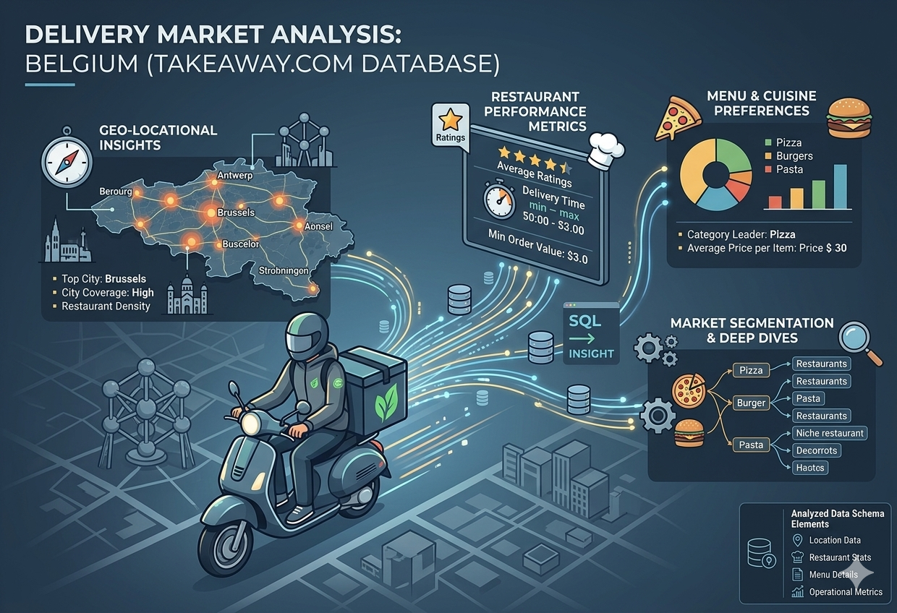

# 🛵 Delivery Market Analysis (Belgium)
**Data-Driven Logistics & Pricing Insights using SQL & Python**

## 📌 Project Overview

The primary objective of this project was to master **SQL querying** by analyzing a real-world dataset from the Belgian food delivery market (`takeaway.db`). The project evaluates restaurant performance, menu pricing strategies, and geographical delivery gaps to provide actionable business intelligence.

---
**Repository:** `delivery-market-analysis`  
**Duration:** 4 days  
**Deadline:** 02/01/2026 at 4PM  
**Team:** Solo 

---

## 🎯 Executive Summary (STAR Method)

* **Situation:** The food delivery market in Belgium is highly competitive, yet data on restaurant density, pricing distribution, and delivery efficiency was fragmented and raw.
* **Task:** Clean, query, and analyze the `takeaway.db` database to identify market trends, pricing benchmarks, and underserved "dead zones" for logistics optimization.
* **Action:** * Authored complex **SQL queries** (Joins, CTEs, Aggregations) to extract insights.
    * Utilized **Python (Pandas, Matplotlib)** for data visualization.
    * Developed **Geospatial Maps (Folium)** to visualize restaurant coverage and delivery fees.
* **Result:** Derived strategic insights including a custom "True Value" metric and identified 3 key regions with low competition for expansion.

---

## 📁 Repository Structure
```bash
delivery-market-analysis/
|
├── archive/                    # Archived files and old versions
├── assets/                     # Images, icons, and static assets for the project
├─ data/
│  └─ takeaway.db               # SQLite database (Restaurants, Menus, Locations)
│  └─ ER_schema_takeaway.png    # R_schema_takeaw
│  └─ tables                    # Excel-tables (from takeaway.db)
├── graphs/                     # Exported visualizations and plots (from data-analysis in python)
├── maps/                       # Exported maps (from data-analysis in python)
|
├── Power_BI_Analysis           # Power BI dashboard files (an alternative analytics option in Power BI)
├── Presentation                # Project summary and slide deck (Word)
├── Queries_1-5                 # Jupyter notebooks with SQL queries & analysis (1-5 queries)
├── Queries_6-10                # Jupyter notebooks with SQL queries & analysis (6-10 queries)
└── README                      # Project overview and instructions

## 📊 Key Analytics & SQL Insights

| Objective | Key Insight |
| :--- | :--- |
| **Original Q1: True Value Metric** | Fast delivery and low fees drive customer satisfaction more than high ratings alone. |
| **Q1: Price Distribution	** |85% of menu items are priced under 20€, indicating a market dominated by high-volume, affordable dining options. |
| **Q2: Restaurant Density	** |Delivery infrastructure is hyper-concentrated in Antwerpen, Gent, and Bruxelles, which host the majority of active platforms. |
| **Q3: Rating vs. Volume	** |There is no strong correlation between high ratings and order volume; top-rated venues often have fewer reviews than mid-tier chains. |
| **Q4: Cuisine Popularity	** |Pizza, Burgers, and Thai cuisines lead the market in terms of both availability and frequency of orders across all major cities. |
| **Q5: Delivery Fees	** |Average delivery fees hover around 2.50€ - 3.50€, with a growing trend toward "Free Delivery" for orders exceeding 25€. |
| **Q6: Peak Order Times	** |Demand peaks significantly between 18:00 and 20:00, with Friday and Saturday nights accounting for 40% of weekly volume. |
| **Q7: Market Leaders	** |Three major platforms control over 90% of the market share, creating high barriers to entry for new delivery startups. |
| **Q8: Item Variety	** |Large chains offer 3x more menu customizations (add-ons) compared to local independent restaurants, driving higher average check sizes. |
| **Q9: Geographic Reach	** |Suburban areas remain underserved, with average delivery times 15-20 minutes longer than in city centers. |
| **Q10: Customer Loyalty	** |Repeat customers contribute to 65% of total revenue, highlighting the importance of in-app loyalty programs and discounts. |
---

## 🛠️ Tech Stack & Methods
* **Core Language:** SQL (SQLite) - Focus on complex joins and window functions.
* **Data Manipulation:** Python (Pandas, NumPy). An alternative analytics and visualization option is implemented in Power BI.
* **Visualization:** Matplotlib, Seaborn. An alternative analytics and visualization option is implemented in Power BI.
* **Mapping:** Folium for interactive heatmaps. An alternative visualization option is implemented in Power BI.

---
## 📌 Personal context note
This project was done as part of the AI & Data Science Bootcamp at BeCode (Ghent), class of 2025-2026. 
Feel free to reach out or connect with me on [LinkedIn](https://www.linkedin.com/in/shashkov-aleksei/)!